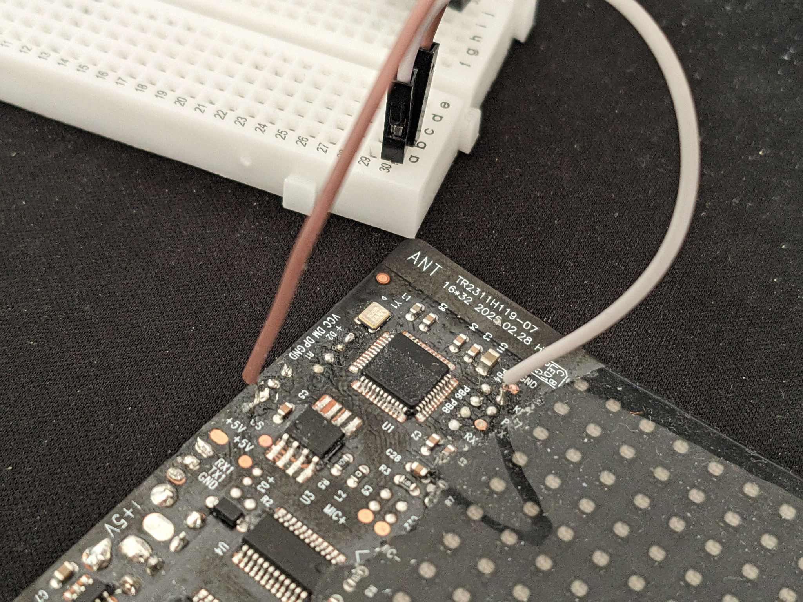
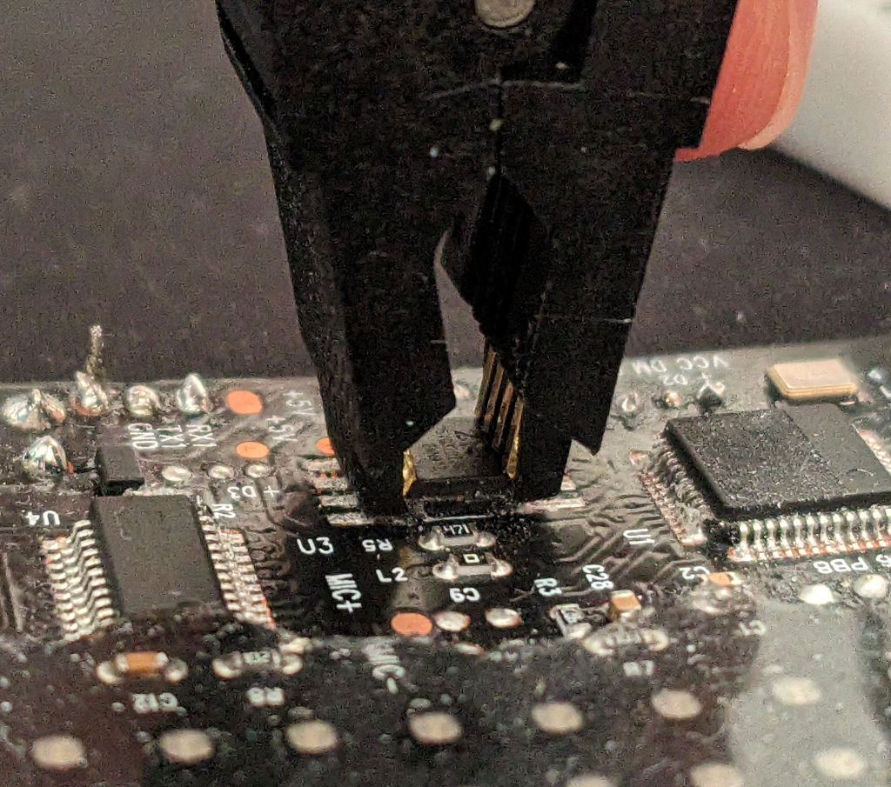
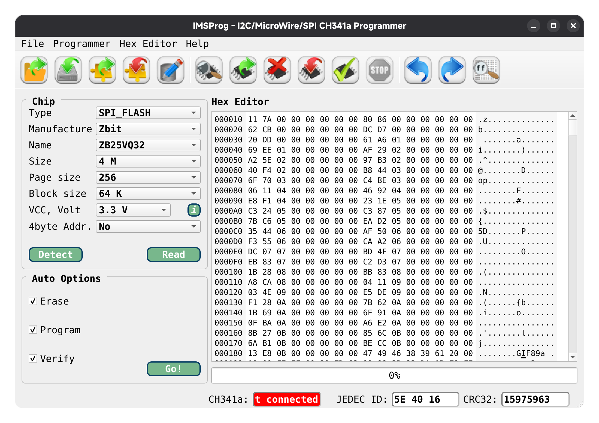

# Dumping the SPI Flash Memory

The matrix device use an SPI flash memory to store images and other data. To dump the contents of the SPI flash memory, you can use a SPI programmer such as the CH341A.

## WARNING

The process of dumping or modifying the SPI flash memory can potentially brick or damage your device if not done correctly. Proceed with caution and at your own risk. Always ensure you have a backup of the original data before making any changes.

## Required Tools

- USB SPI programmer with 3.3V support (e.g., CH341A)
- 8‑pin SOIC test clip for connecting to the SPI package
- IMSProg Software
- Soldering Equipment
- Computer with USB port

## Step by Step Guide

This guide has been tested on 32x16 LED Matrix device, but should work on other similar devices as well.

1. **Disconnect the Device from Power**: Ensure the device is completely powered off and disconnected from any power source.
2. **Remove the Device Covering**. This is a destructive process but there is no other way to access the SPI chip. Try to clean has much as possible the area around the SPI chip to avoid false connections.
3. **⚠️ VERY IMPORTANT ⚠️** : Connect the `KEY` pin of the MCU to a ground (GND) to maitain the device in a reset state BEFORE connection. This is crucial for two reasons :
    1. It prevents the MCU to interfere with the SPI communication.
    2. It keeps the LED Matrix powered off, preventing any power surges that could damage the LED panels.

Failing to do so can result in permanent damage to the device (I'm talking from experience here).
4. **Use the 8-pin SOIC Test Clip** to connect the SPI programmer to the SPI chip. Make sure to connect the pins correctly.
This step is a bit tricky due to the small size of the chip and the proximity of other components. Take your time to ensure a good connection.

5. **Checking the chip** On IMSProg, click on detect chip.
6. **Reading the chip** If the chip is detected, press "Read", then wait for the process to complete. This take a minute or two.

7. **Save the dumped file to your computer.**

## Additional Notes

- Make sure to handle the SPI chip and programmer with care to avoid static discharge damage.
- Always back up the original dump before making any modifications.
- After completing the dump, remember to disconnect the `KEY` pin from the MCU to allow normal operation of the device.
